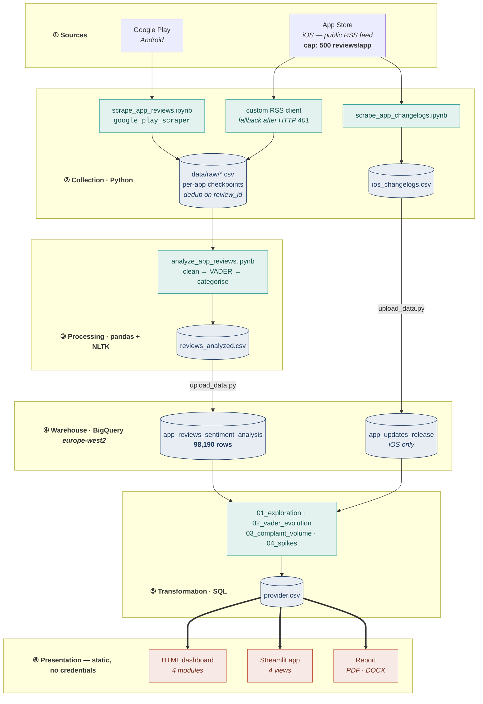
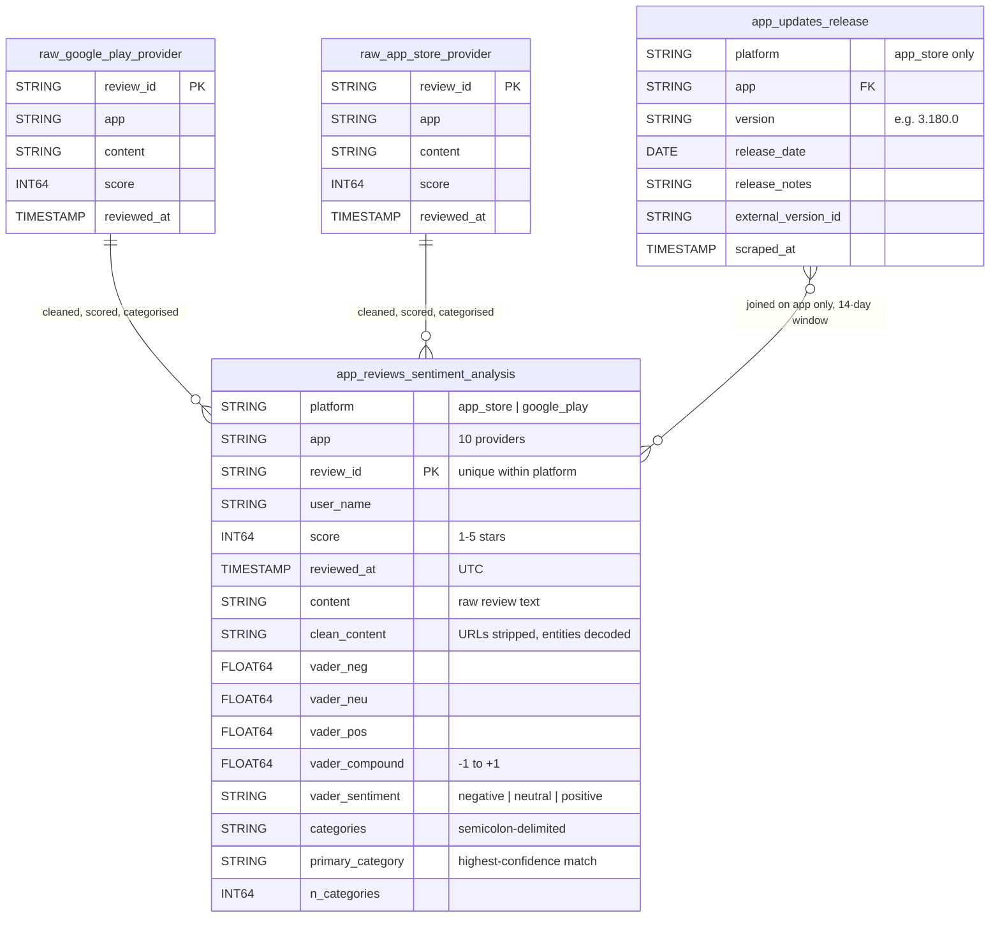
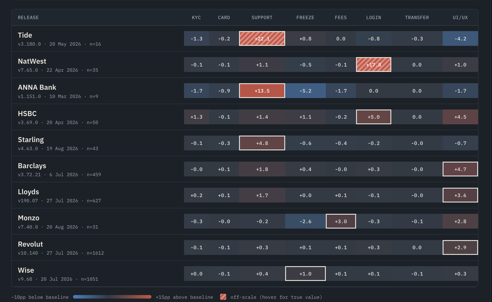

## Table of Content:
1. Project Background
2. Business Context
3. Scope
4. Executive Summary
5. Data Structure and Initial Checks
6. Analytical Insights 
7. Recommendations
8. Issues Encountered
9. Limitations, Caveats and Assumptions
10. Author

## Project Background:

Mobile banking apps are one of the most common ways an individual can manage their personal finances today.

In recent years branch-closure programmes have spread across the retail banking industry as customers adopted this new approach to banking. App reviews thus became a way for customers to express their frustration, partially substituting physical branches as the main communication channel.

From a data analyst's perspective, reviews act as a continuous record of this frustration: public, auditable, unsolicited and timestamped. They are also rich in usable metadata, making them a suitable object for descriptive or diagnostic analytics.

## Business Context:

The app-centric approach within the UK retail banking landscape can be segmented into two major provider groups:

Traditional banks, represented by four main banks whose origins run from the 17th to the 19th century and are still in operation today: NatWest, Barclays, Lloyds Bank and HSBC. 

NeoBanks (also known as Challenger banks), emerging from FinTech firms that from the mid-2010s onwards shaped their business model to closely resemble what their established competitors offered, delivering app-first retail and business account-holding solutions.

In this analysis they are represented by: Monzo, Revolut, Starling, Tide, ANNA Money and Wise.

## Scope:

To compare strengths and weaknesses of both business models, i.e. Traditional banks vs NeoBanks, this analysis focused on gathering review data for UK retail and business apps, for iOS and Android platforms. The period covered spans August 2025 to August 2026, comprising 98,190 reviews across ten providers. 

Understanding how and when customer sentiment shifts can help establish common points of friction that can lead to undesirable outcomes: loss of revenue, reputational damage, or rising customer acquisition costs.

This project focuses on mapping sentiment to measurable dimensions across time: release events, cohort, and complaint drivers.

The investigation focuses on the following key questions:

- Can a new app release produce a noticeable spike in negative reviews?
- Does the sentiment across the two cohorts diverge? Which providers are more at risk of churn?
- What are the most common drivers prompting customers to complain across segments?
- Is there a noticeable effect on Customer Acquisition Cost as negative review numbers increase?
	- _**Note:** this should be considered as a hypothetical model built against plausible market figures. For more information see **Limitations.**_

This analysis is a proof of concept structured as an end-to-end pipeline: collection, transformation, analysis and reporting.
## Executive Summary:

Across 98,190 App Store and Google Play reviews of ten UK banking apps between August 2025 and August 2026, the headline finding is a reversal: Traditional banks began the window rated _above_ the NeoBanks cohort and ended it clearly _below_.

Traditional banks' average rating fell from 4.39 (Sep 2025) to **3.61** (Aug 2026) — a 0.78-point decline concentrated almost entirely in the final quarter. NeoBanks moved barely at all over the same period, 4.16 to 4.06, having peaked at 4.46 in February 2026. The crossover occurs in **June 2026**, and from that point the two cohorts diverge considerably. One-star share tells the same story more sharply: Traditional banks' one-star reviews more than doubled, from 12.1% to 25.5%.
## Data Structure and Initial Checks:

I collected the data from two major marketplaces: App Store (iOS) and Google Play (Android). 

I wrote scripts in Python using the OpenCode agentic harness within an IDE Terminal; `google_play_scraper` for Android and a custom RSS client for iOS after Apple's authenticated endpoint consistently returned 401 due to my workstation's inability to generate a working JSON Web Token (JWT).

The UK mobile banking providers that I decided to examine for this analysis are the following:
Barclays, NatWest, Lloyds Bank, HSBC, Monzo, Revolut, Starling, Wise, Tide, and ANNA Money.

The review volume is heavily skewed towards Revolut (29,002) and Wise (25,928), while ANNA Money (115) and Tide (620) sit at the opposite side of the distribution. I weighted every per-app claim accordingly.

I wrote additional Python scripts to parse, clean and structure the data before uploading it to Google BigQuery with a final Python script. 

##### Data Quality:
During the data quality checks, I applied three conditions before running any analysis:

- Reviews are restricted to Aug 2025 – Aug 2026. Per-app historical review volume varies wildly in the raw data because the scrape stopped on a review-count quota rather than a fixed start date. I restricted the time window over which all ten providers are genuinely comparable.

- App–month cells with fewer than 10 reviews are excluded from trend charts, to avoid further skew in the distribution, as such low volume cannot produce a stable average.

- During the checks I acknowledged that some providers were not perfectly suitable for the intended scope. I decided to exclude Klarna due to its lending-oriented services as a Buy Now Pay Later (BNPL) provider, and to keep Wise, ANNA Money and Tide: while their regulatory status is different from that of a licensed bank (Electronic Money Institution for ANNA Money and Wise, Banking-as-a-Service for Tide), they still offer services comparable to traditional account-holding institutions.

##### Pipeline Structure:
A schematic of the pipeline and the BigQuery schema are as follows:

> End-to-end pipeline. Double arrows mark the security boundary: every published
> artefact reads a static CSV export, so no deployed component holds a BigQuery
> credential.  _**Note:** Release notes are collected for iOS only._

##### BigQuery schema

> Warehouse schema. Raw tables are landed one per provider per store (22 in
> total; two shown as representative). The join between releases and reviews is
> many-to-many by design — a single day can fall inside more than one release
> window when versions ship less than 14 days apart.

The BigQuery warehouse holds three layers: one raw table per provider per store, a release-history table used to align reviews to app versions and a single transformed review table, containing a total of 98,190 records.

## Analytical Insights:

### Insight 1: Negative Review Spikes vs App Updates Rollout

Friction per app release registers as a sporadic episode and is not linked to each new release. Within the period covered only three out of ten app versions show an out-of-range complaint spike:

Tide v3.180.0 (+22.1pp above its own baseline) and NatWest v7.65.0 (+17.8pp) display a complaints volume off scale against baseline.
The third provider, ANNA Money, displays a considerable spike of +13.5pp for version 1.151.0, within assumed boundaries but still a considerable movement.
The remaining seven sit between +1.0pp and +5.0pp, which is ordinary spread. 

> As a note, due to lower sample size, smaller apps such as Tide and ANNA Money tend to be more volatile compared to other providers.

### Insight 2: Sentiment Trend Comparison and Churn Risk Benchmark

![[sentiment-trend.png]]

The average rating movement for both cohorts shows a similar trend up to June 2026, when Traditional banks decline sharply while NeoBanks' rating remains stable as in previous months.

Notable trend reversals include:
- NeoBanks' average rating jumps from 4.08 to a peak of 4.46 in December 2025
- June 2026 marking a sharp drop for Traditional banks.
	Branch-closure programmes and service disruptions are potential candidates for this drop and should be tested directly.

![[churn-risk-table.png]]

The bottom dashboard highlights churn risk and the average rating movement for each provider. 

Barclays, Tide, and HSBC lead the churn risk table, with the first two displaying an erosion of average app review rating.

> _**Note:**_ Churn Risk is calculated as the monthly one-star reviews share within the same period.

### Insight 3: Customer Complaint Drivers
![[complaint-drivers.png]]

For the NeoBank cohort, observed complaints cluster on Account Freeze and Restrictions (with a 6.5 pp above baseline), immediately followed by Customer Support Friction (+4.2 pp).

Traditional banks lag behind in technological delivery: Login/Access Issues and UI/UX Bugs (-1.4pp and -4.6pp respectively) are the most common among the oldest institutions.

Thanks to a leaner infrastructure, Challenger banks adopt new technologies at a faster pace than Traditional bank competition. On the other hand, compliance and onboarding are common pain points for NeoBanks' customers.

### Insight 4: Customer Acquisition Cost Modelling
![[friction-exposure-table.png]]

This section is a hypothetical Customer Acquisition Cost (CAC) model built with plausible market benchmarks and estimated 10,000 app installs.

HSBC leads the table with the highest exposure to CAC friction (0.75%) with an Annual CAC at Risk per 10K installs of £24,255.

ANNA Money, Tide and Wise are the most at risk for the NeoBank cohort. 
ANNA Money leads with £4,823 Annual CAC at Risk, Tide at £3,576 and Wise at £1,525.

## Recommendations:

_**For release management**_
The product delivery department could monitor the post-release complaints on a 14-day window against each app's own trailing baseline.

The three genuine spikes here would all have been visible within this monitoring period, as all three trace to identifiable feature changes:
- Tide UX redesign combined with disruption to the QR/receipt scanning feature
- NatWest new Pots feature rollout causing balance mismatches and ensuing login issues after disaster recovery
- ANNA Money unhelpful AI customer service agent

A release-gated rollback threshold set at roughly +10pp above baseline would have caught all three and none of the seven false positives.

_**For Traditional banks**_
The rating decline from June 2026 is the most apparent movement in the dataset. Further research could correlate branch-closure programmes and service disruptions with the observed decline. 
A statistical hypothesis testing joining incident logs and closure calendars is advisable.

_**For NeoBanks**_
Account freezes and restrictions are the single largest complaint category (+6.5pp).
The nature of the problem is compliance-driven, but the observed effect is on customer service: This calls for clearer customer communication during the onboarding process and after-care steps to limit friction between compliance and customer acquisition.

**_Next steps_**
The results of this analysis lend themselves to extension as a predictive churn model rather than a sentiment model. One-star share is used here as a churn proxy because no account-cancellation data exists in the project; pairing this sentiment series with actual attrition data would convert a descriptive analysis into a predictive one.

## Issues encountered:

**_App Store's 500-review limit:_** The authenticated Apple endpoint returned 401 due to a malformed JSON Web Token (JWT); several attempts to generate different keys returned the same result. I approached the collection phase with an alternative method: a public RSS customer-reviews feed. The drawback is that the feed can supply a maximum of 10 pages of 50 reviews, so no iOS app can exceed 500 reviews regardless of how many exist — which is why the dataset is composed of 96% Android records. 
	**_It can be avoided by:_** Designing the data collection requirements beforehand, including source(s), desired sample size, and external dependencies requirements.

**_Filtering at the query instead of removing at the source:_** Klarna was filtered during the SQL querying layer but the rows stayed in the dataset, occupying storage and polluting the dashboards by trickling down the pipeline as an unidentified "Other" provider group.
	**_It can be avoided by:_** Deleting unneeded data at the source. Data Quality needs to side with Data Requirements and Governance processes as a single pass-on check.
	
**_High Volume Providers elude the negative spike threshold:_** Revolut and Wise had no spikes detected at all. Their review volume is high enough that no single day moves the daily average past the baseline. This is a limitation of the threshold-based approach.
	**_It can be avoided by:_** Implementing a more rigorous approach than absolute deviation from the baseline: a normalised threshold, z-score or IQR-based, could address this issue.

**_Architecture chosen too early_:** The dashboard originally queried BigQuery live using a service-account key stored in the cloud platform's secrets. Due to security concerns as the project is a public portfolio piece, that feature was reconsidered. Removing that capability required stripping the client, rewriting a page that could not run without it.
	**_It can be avoided by:_** Similarly to issue 1, a planning and testing phase must be implemented before deploying.

## Limitations, Caveats and Assumptions:

**_Proof of concept_** 
This project is built to demonstrate an analysis pipeline end to end, not to produce audited figures for commercial decisions. It is a static snapshot with no live refresh; every number is as of end of August 2026.

**_The CAC model as a plausible, but not real-world ready model_**
Due to missing account-cancellation data, industry benchmarks were employed in the calculations to build the model.

The model assumes the following inputs:
- Traditional banks ≈ £120–£280
- NeoBanks ≈ £4–£25
- a 77% review read-through rate
- 20% abandonment uplift

Each figure is applied to each provider's observed onboarding-complaint prevalence. None of those four assumptions is directly measured from this data.

**_Acquisition Channels Difference_**
Traditional banks acquire new customers across branches, web, direct mail and aggregators; NeoBanks are effectively digital-only. The two cohorts are benchmarked separately for this reason, but this distorts the magnitude of the actual effect.

**_Limited sample size in CAC inputs_**
Three of the four providers in the "highest exposure" bucket rest on fewer than ten reviews. Only Wise, Revolut and HSBC (n = 28) have counts that support any comparison at all. The table should be read as a demonstration of method, not as a ranking of real commercial exposure.

**_VADER's limits on this text_**
VADER is a rule-based lexicon tuned for social media. It cannot read sarcasm, and could score a factual one-star complaint written calmly as near-neutral. Sentiment labels here should be treated as a coarse filter, not as a precise measurement.

Alternatives, while still being vulnerable to edge cases, could employ a transformer-based analysis (especially an ad-hoc finance transformer), or a DBSCAN clustering / SVM classification oriented analysis depending on labelled dataset availability.

**_Changelog data available for iOS only_**
Google Play does not make public changelogs for apps stored in the marketplace. While some alternative options were available, none of them were programmatic. iOS changelog data was used as a proxy for app releases.

## Author

  

  <strong>Brian Tomassoni</strong> 
  <em>Data Analyst · Credit Risk Domain</em>

  
  &nbsp;
  
  &nbsp;
  

  Built as a portfolio project demonstrating end-to-end ML system design, 
  credit risk domain knowledge, and production-aware engineering practices.

